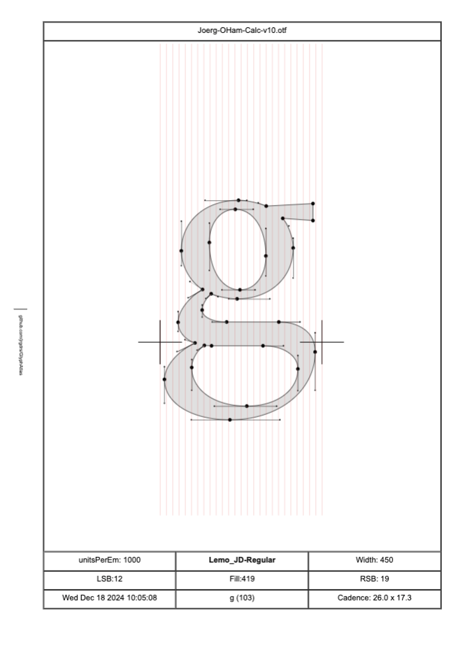

# GlyphAtlas
Reads font files and oproduces an html file which can be printed to document the details of shapes and metrics. Works with otf and woff 

## Install
If node.js installes run npm install in the directory

## Run
Call node.js with path to font file as parameter and pipe the output into the target html file, see run.sh

